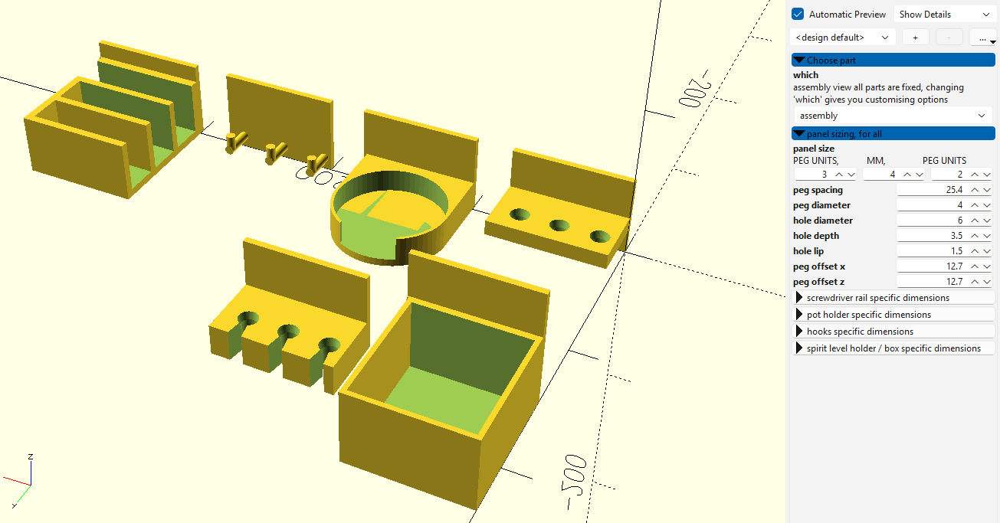
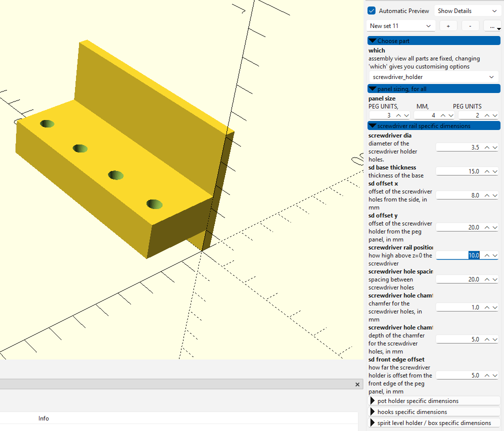
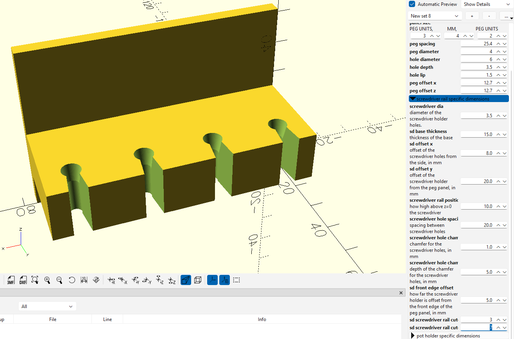
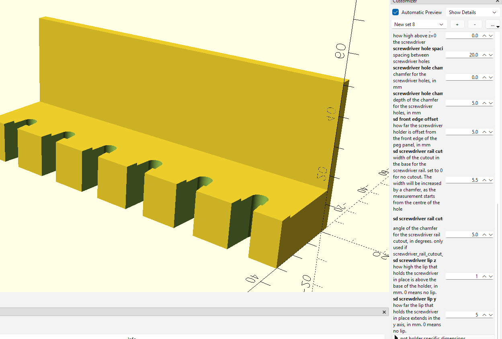
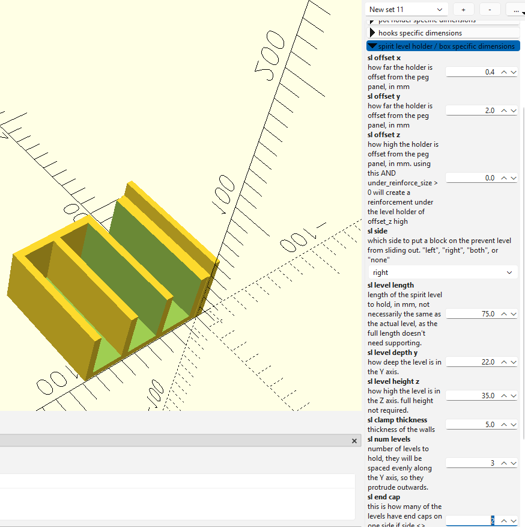
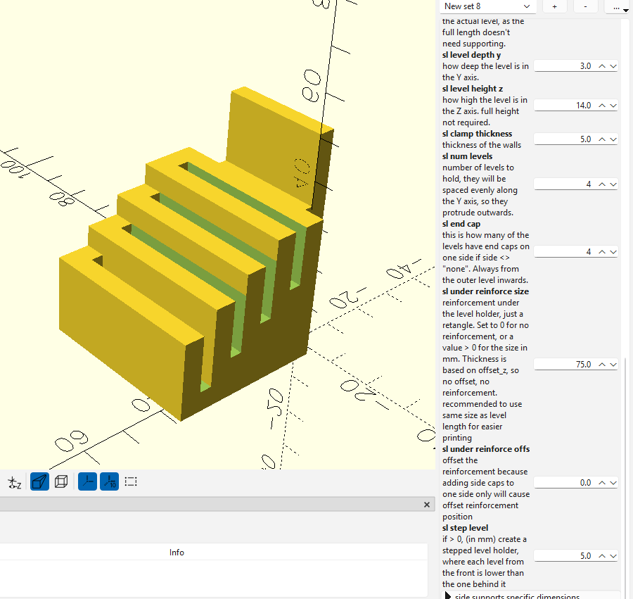
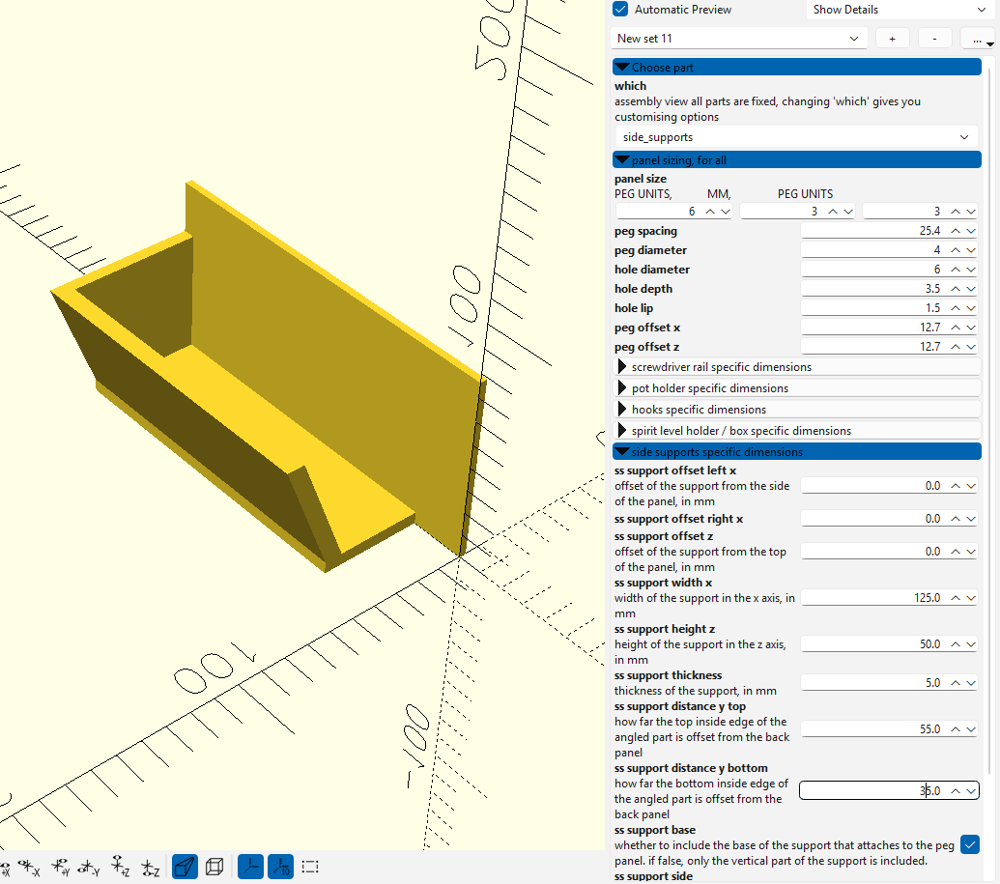
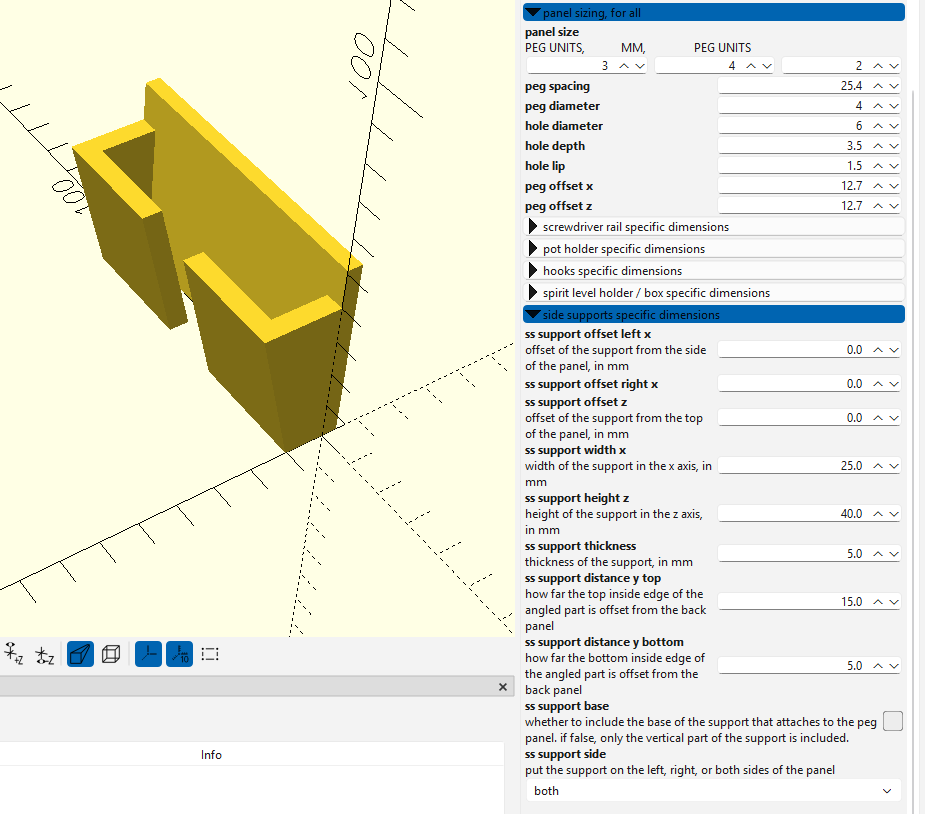
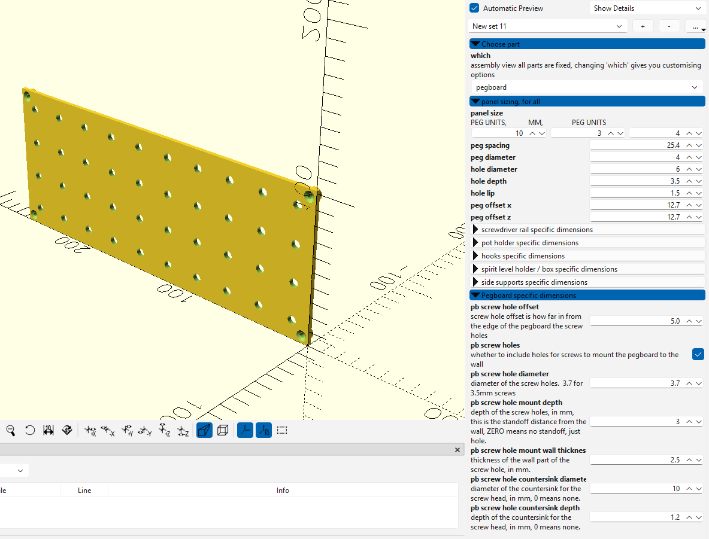
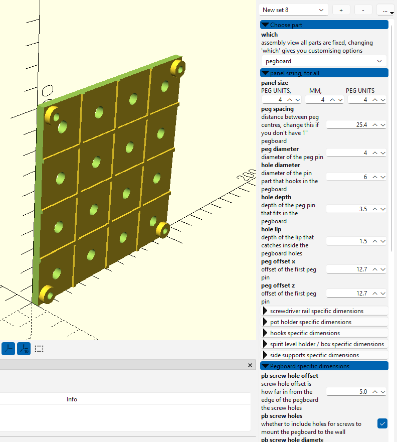

# Pegboard tool holders in OpenSCAD

I designed this because I have 1" spaced pegboard, but wanted to be able to also do other peg spacing.

### It can be easily adapted to metric 25mm, or any other size, right within the customiser, so long as the holes are circular and in a square grid.

Everything about it is customisable. Maybe even for skadis, but I don't have any to test against. It would require offsetting each row of pegs though, because skadis offsets the rows from each other.

All the parts can be created from assembly.scad, by default it loads an overview.
By choosing which part to create, you can make any of the parts I've designed, in any size you want.

Before printing a bunch of stuff, I recommend doing a small print first to check the tolerances. My 0.4mm nozzle created nice 'n' tight fitting pegs, my 0.6mm created loose fitting pegs. 

Anyway, if you like the design, you're welcome to buy me a coffee:

A look at the back. The number of pegs is defined by the peg units.
The width and height of the back panel is defined by peg units and peg spacing. If you change to a 25mm peg spacing, it'll be smaller than my 25.4mm spaced ones.
The thickness of the peg panel back is in MM.

A small double box.

A pot holder with a front cutout

A small screwdriver rail

The same rail, but with a cutout for inserting stuff from the front

How about some lips?

Some hooks for hooky stuff, looks a bit jank because I didn't want to math out a curve, plus printing a upwards curve means supports for overhang.

Spirit level holder - this comes from the same model as the box, just by having the sides open.

By choosing a side, endcaps, and levels, you can create multi holders, some with openings, some without, at the same time if you want.

You can also set step_level in mm, to offset each part

Side support, this is for supporting stuff from the side, can be angled. Stuff like laptops could be supported this way. Can be supported either or both sides, with or without the base.

How about a custon pegboard? As many 'oles as you like.

Want a reinforced back to it? Sure!

Licence is CC-non commerical

AI used was co-pilot to refactor and fix my mistakes. co-pilot is very good at that, but cannot create a openscad model from scratch.