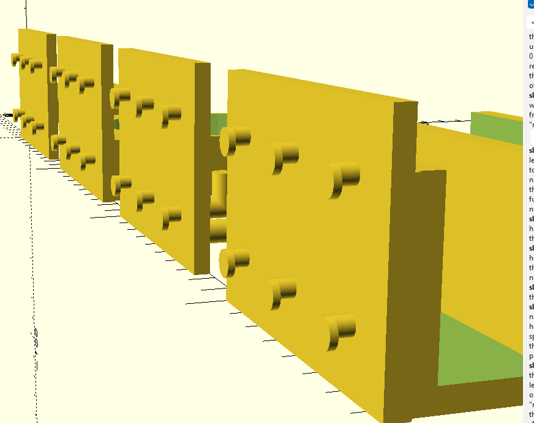
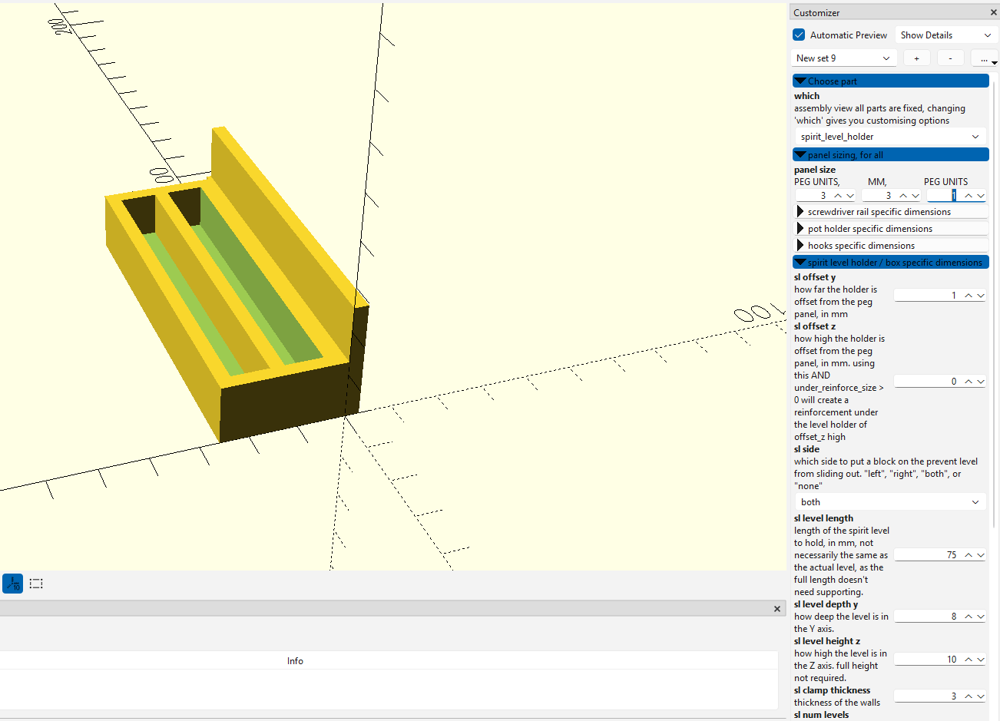
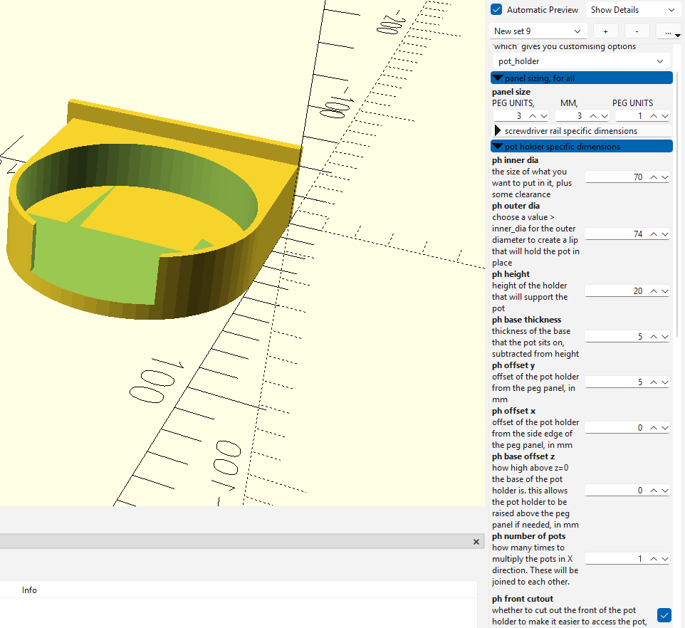
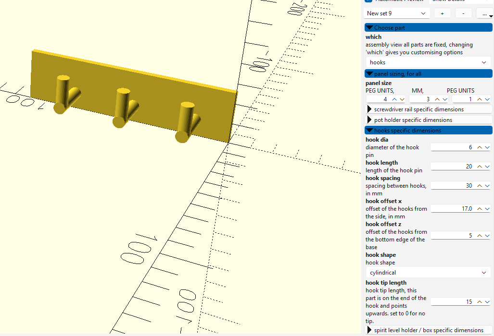
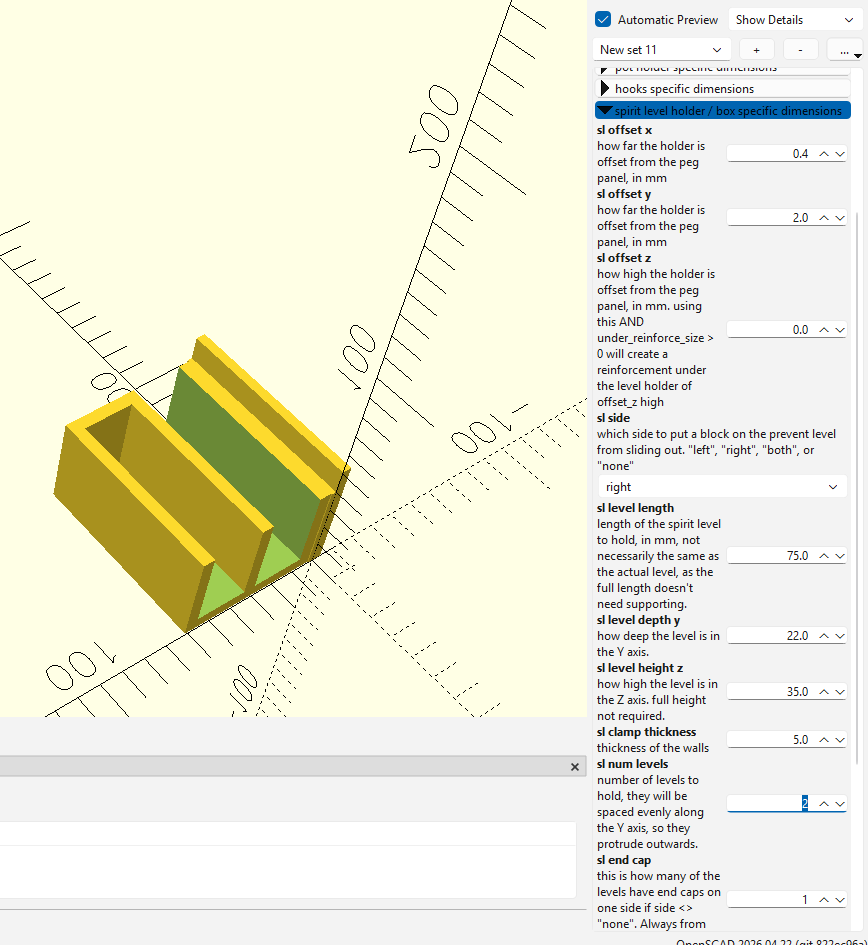

# Pegboard tool holders in OpenSCAD

I designed this because I have 1" spaced pegboard, but wanted to be able to also do other peg spacing.

### It can be easily adapted to metric 25mm, or any other size, so long as the holes are circular and in a square grid.

Everything about it is customisable. Maybe even for skadis, but I don't have any to test against.

All the parts can be created from assembly.scad, by default it loads an overview
By choosing which part to create, you can make any of the parts I've designed, in any size you want.

A look at the back. The number of pegs is defined by the peg units.
The width and height of the back panel is defined by peg units and peg spacing. If you change to a 25mm peg spacing, it'll be smaller than my 25.4mm spaced ones.
The thickness of the peg panel back is in MM.

A small double box.

A pot holder with a front cutout

A small screwdriver rail

Some hooks for hooky stuff

Spirit level holder - this comes from the same model as the box, just by having the sides open.

By choosing a side, endcaps, and levels, you can create multi holders, some with openings, some without, at the same time if you want.

