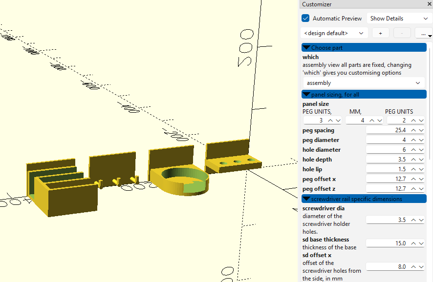

# Pegboard tool holders in OpenSCAD

I designed this because I have 1" spaced pegboard.

### It can however, be easily adapted to metric 25mm, or any other size, so long as the holes are circular and in a square grid.

Everything about it is customisable. Maybe even for skadis, but I don't have any to test against.

